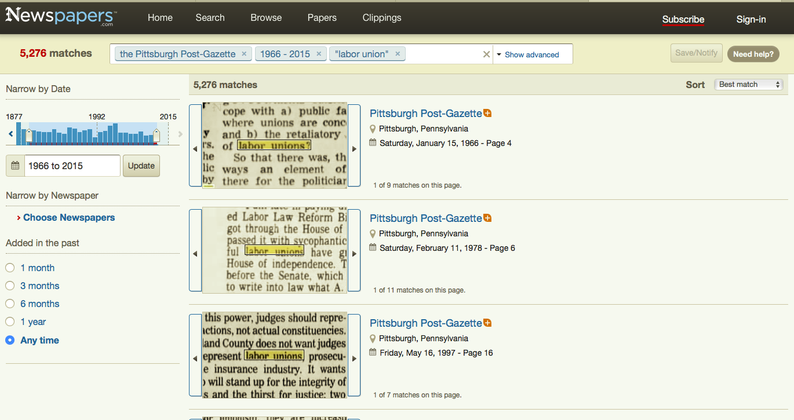

```{r setup, include=FALSE, debug = TRUE}
knitr::opts_chunk$set(echo = TRUE)
library(tidyverse)

```

## Draft of "About" Page for Final Project

### Overview of Thesis Topic 

My final project for Gov 1005 is centered around understanding certain national trends for my thesis topic. My senior thesis in Government (2020-2021, advised by Professor Theda Skocpol) will explore the evolution of the political and social salience of industrial labor unions over time. Over the past 50 years, the reliability of union members (particularly industrial union members, as opposed to professional union members such as teachers or nurses) to vote Democrat has decreased dramatically. I will use Southwestern Pennsylvania as a representative ("typical") case to investigate the phenomenon of industrial union members feeling less obligated to the political priorities of the union.

The image below  was provided to me by Dr. Lara Putnam, a professor at the University of Pittsburgh. It depicts (on the orange line) the relationship over time between high-density union counties and Democratic vote share.

```{r unions, echo=FALSE, fig.cap="", out.width = '90%'}
knitr::include_graphics("Unions.png")
```

My overarching thesis research question (though it may evolve slightly) is: how has the social role of the industrial labor union changed over time, and how has this evolution impacted the individual political choices of union members?

To answer this question, I am planning on using several modes of analysis, including archival research (union records and newspapers), quantitative analysis (from existing public opinion data), and qualitative analysis (from questionaires and interviews with current union members and retirees).

### Overview of Data Analyses for Gov 1005:

For Gov 1005, I plan on performing *some* of the quantitative data analysis that will be necessary for my thesis. Before I dive into my on-the-ground research, I want to first understand the national, state-level, and county-level time-series trends regarding union density, population composition, and voting choices. 

I plan to use the American National Elections Survey and Census data (at least) for my the nation-wide aspect of my final project. I also plan to begin to analyze newspapers as part of my final project. I found a really great data source that has comprehensive newspaper archives. This is what the source looks like:

```{r newspapers, echo=FALSE, fig.cap="", out.width = '90%'}

```

I will need a subscription for the Newspapers.com service, and I am not sure if it will let me download the data. I am reaching out to my thesis advisor and Hugh Truslow to see if I can get a subscription to this service through Harvard. That being said, I know that this might be a slower process, so I am going to start my final project with ANES and census data.

The ANES (starting in 1966) asks the question (D13 "DOES ANYONE IN THIS HOUSEHOLD BELONG TO A LABOR UNION?" [D13A. (IF YES)] "WHO IS IT THAT BELONGS?") The ANES is assessed every 2 years and also has ample questions regarding political preferences and voting behavior. This may be a more suitable study to use for these purposes because it goes back all the way through my time period of interest.

I plan to involve census data in order to understand the changing demographics of the counties that I am studying within Pennsylvania. However, the census does not ask a question about union affiliation. I reached out to Dr. Putnam to ask her what data she used for the first image above, because I would love to be able to get down to the county level in Pennsylvania to understand union voting patterns over time.  


Here is the link to my Github repository for my final project: https://github.com/laineynewman/gov1005_finalproject.


