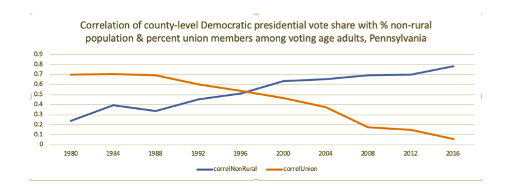

```{r setup, include=FALSE}
knitr::opts_chunk$set(echo = TRUE)
library(tidyverse)

```

## Directions for Milestone #3

Create a new Github repo. This is the first version of your final project. (There will be many more to come.) Write an Rmd which provides a draft of your About page. (Naming it about.Rmd is wise.) Knit that Rmd into an html and submit the html via Canvas. The Rmd should include the url to your repo, should we want to examine it. Discuss all your data sources in the Rmd. (If you are gathering Harvard data, you should have a draft of your survey questions.) With luck, you will have gathered all your data and placed it in the repo. (This will generally be done with a different Rmd, like gather.Rmd, in your repo which contains the code which actually downloads your data.) You should have processed your data. (It is OK if you have not gotten quite this far as long as you discuss your progress and your plan in the About page.) Remember: You must gather data from two or more different sources. Learning how to source, clean and combine data is one of the goals of the project. On almost any topic, there are useful tables of information on Wikipedia. See here and here for advice.

## Draft of "About" Page for Final Project

My final project for Gov 1005 is centered around understanding certain national trends for my thesis topic. My senior thesis in Government (2020-2021, advised by Professor Theda Skocpol) will explore the evolution of the political and social salience of industrial labor unions over time. Over the past 50 years, the reliability of union members (particularly industrial union members, as opposed to professional union members such as teachers or nurses) to vote Democrat has decreased dramatically. I will use Southwestern Pennsylvania as a representative ("typical") case to investigate the phenomenon of industrial union members feeling less obligated to the political priorities of the union.

The image below  was provided to me by Dr. Lara Putnam, a professor at the University of Pittsburgh. It depicts (on the orange line) the relationship over time between high-density union counties and Democratic vote share.

```{r figurename, echo=FALSE, fig.cap="", out.width = '90%'}

```

My overarching thesis research question (though it may evolve slightly) is: how has the social role of the industrial labor union changed over time, and how has this evolution impacted the individual political choices of union members?

To answer this question, I am planning on using several modes of analysis, including archival research (union records and newspapers), quantitative analysis (from existing public opinion data), and qualitative analysis (from questionaires and interviews with current union members and retirees).

For Gov 1005, I plan on performing *some* of the quantitative data analysis that will be necessary for my thesis. Before I dive into my on-the-ground research, I want to first understand the national and state-level time-series trends regarding county-level union density, population composition, and voting choices. 

I plan to use the American National Elections Survey, the General Social Survey, and Census data (at least) for my final project. 

The GSS asks the question: "Do you (or your spouse) belong to a labor union? (Who?)" 


I have also reached out to Dr. Putnam to ask her what data she used for the image above, because I would love to be able to get down to the county level in Pennsylvania for 


Here is the link to my Github repository for my final project: https://github.com/laineynewman/gov1005_finalproject.


